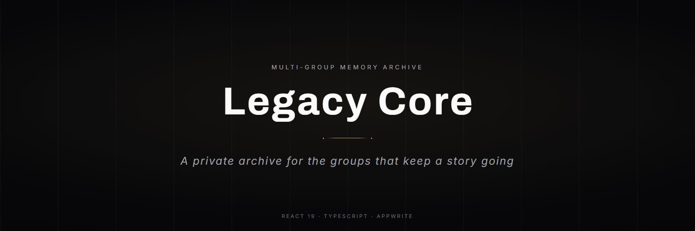

<p align="center">
  
</p>

<p align="center">
  
  
  
  
  
</p>

<p align="center">
  <a href="#features"><b>Features</b></a> &nbsp;•&nbsp;
  <a href="#stack">Stack</a> &nbsp;•&nbsp;
  <a href="#structure">Structure</a> &nbsp;•&nbsp;
  <a href="#getting-started">Getting started</a> &nbsp;•&nbsp;
  <a href="#decisions">Decisions</a>
</p>

Legacy Core holds the memory of a group: who belongs to it, what happened and when, the photographs, and the long-form pieces someone sat down to write. Several groups live in the same deployment, each seeing only its own archive, and nobody gets in without an admin letting them in first.

## Features

- **Group-scoped by default.** Switch groups and the directory, timeline, gallery and narratives all follow. Nothing leaks across.
- **Member directory with profiles.** Each member has a card in the directory and a page of their own.
- **Shared timeline.** The group's events, ordered and browsable, editable from the admin console.
- **Long-form narratives.** A TipTap editor with inline images, placeholders and character count, so a story gets written as a story and not as a caption.
- **Voice comments.** Record audio in the browser and attach it to a narrative, alongside the written replies. Some memories are worth hearing in the voice that carries them.
- **Approval flow.** New accounts land on a pending screen until an admin approves them — the archive is private, so joining is a decision someone makes.
- **Two levels of administration.** A per-group console for members, timeline, gallery, narratives and settings; a global console above it.
- **Composable backgrounds.** Aurora, mesh gradient, particles, grain, spotlight and interactive grid, each its own layer component, combined per page.

## Stack

| Layer | Technology | Why |
|---|---|---|
| UI | React 19 + TypeScript | The archive is a handful of entities rendered many ways; types keep group scoping honest across every page |
| Build | Vite 6 | `tsc -b` then bundle, so a type error fails the build rather than reaching production |
| Styling | Tailwind CSS 4 | Design tokens declared in `@theme`, no separate config file to keep in sync |
| Backend | Appwrite | Auth, database and file storage in one managed service — a private archive doesn't justify running a server |
| Editor | TipTap | Structured rich text, not a `contenteditable` div: images and placeholders are nodes with rules |
| Motion | Framer Motion + Lenis | Page transitions and smooth scrolling, kept out of the components that hold data |

## Structure

```
src/
  pages/            Home · Directory · Profile · Timeline · Gallery
                    SharedNarratives · NarrativeDetail
                    AdminConsole · GlobalConsole · PendingApproval
  components/
    admin/          Member, timeline, gallery, narrative and request managers
    auth/           Login modal and protected routes
    comments/       Audio recorder, player and comment threads
    groups/         Group switcher, manager and logo
    layout/         App shell and user menu
    ui/             Background layers, modals, empty states, motion primitives
  context/          Group and auth state · hooks/  Shared behaviour
  lib/appwrite.ts   Backend client · types/  Shared type definitions
scripts/            Maintenance: audio bucket creation, data migration
```

## Getting started

Requires Node 18 or newer and an [Appwrite](https://appwrite.io) project.

```bash
git clone https://github.com/SimonOcampo1/legacy-core.git
cd legacy-core
npm install
cp .env.example .env
npm run dev
```

Then fill in `.env`:

| Variable | Value |
|---|---|
| `VITE_APPWRITE_ENDPOINT` | Your Appwrite endpoint, e.g. `https://cloud.appwrite.io/v1` |
| `VITE_APPWRITE_PROJECT_ID` | The project id from your Appwrite console |

The app runs at `http://localhost:5173`.

| Command | What it does |
|---|---|
| `npm run dev` | Development server with HMR |
| `npm run build` | Type-check with `tsc -b`, then build to `dist/` |
| `npm run preview` | Serve the production build locally |
| `npm run lint` | ESLint across the project |

> [!IMPORTANT]
> Audio comments need a storage bucket that does not exist in a fresh Appwrite project. Run `node scripts/create-audio-bucket.mjs` once before recording anything, or uploads fail with a permissions error that reads like an auth problem.

## Decisions

**Multi-group from the first commit, not bolted on later.** Every query is scoped by group id and every route resolves the active group before it renders. Retrofitting that onto a single-tenant archive means auditing every read, and missing one means someone sees another group's photographs.

**Audio comments are stored, not transcribed.** The point of a voice reply is the voice — a transcript would be smaller and searchable, and would lose exactly what makes it worth keeping.
